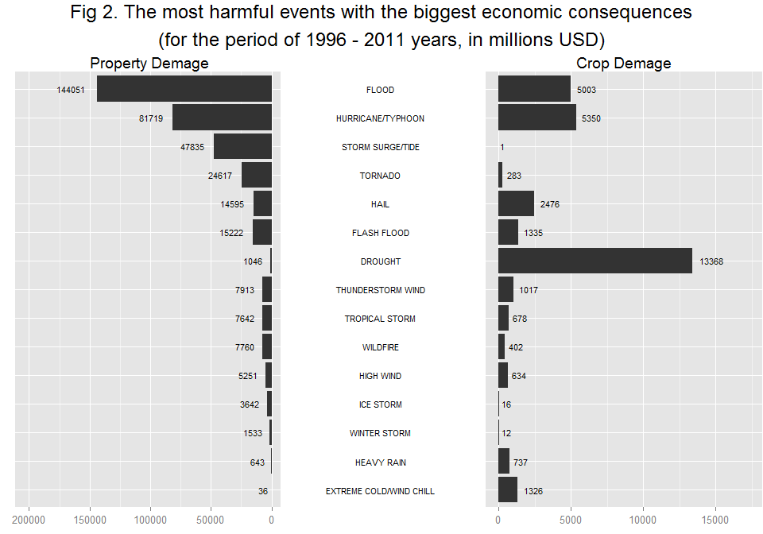

# Health and Economic Impacts of the most hazardous Weather Events in the USA
Dmitry Belyaev  
27 December 2015  

## Synopsis

This report describes the exploration of the NOAA Storm Database and answers some questions about severe weather events with the greatest impact on the population health and economics between 1996 and 2011 years. Analysis was based on the standard of the weather events types declared in the NWS Storm Data Documentation.

The Data processing part of this report explains how the time period of exploration was chosen and describes how the weather event names form the source dataset was brought in accordance with the standard event names.

At the Summary part shown that the most dangerous weather events with impact on the populations health are tornadoes, excessive heat and floods. By the economic consequences the most hazard weather events are floods, hurricanes/typhoons, droughts, storm surges/tides and tornadoes.

## Data Processing

### Data downloading and prerocessing


```r
data_url <- "http://d396qusza40orc.cloudfront.net/repdata%2Fdata%2FStormData.csv.bz2"
data_file <- "repdata-data-StormData.csv.bz2"
download.file(data_url, destfile = data_file, method = "auto")
data_date <- date()
```

The original dataset was downloaded __Sun Dec 27 15:57:06 2015__ as __repdata-data-StormData.csv.bz2__ archive:

* [Storm Data](https://d396qusza40orc.cloudfront.net/repdata%2Fdata%2FStormData.csv.bz2) [47Mb]

Next code unpacks the downloaded .bz2 archive and reads the original dataset:


```r
data <- read.csv(bzfile(data_file))
data_size <- dim(data)
```

Supplied dataset contains __902297__ observations of weather events and __37__ variables. Next variables were used in the present exploration:

* EVTYPE - the type (name) of the weather event;
* BGN_DATE - the date of the weather event;
* FATALITIES - the number of fatalities concerned with the weather event;
* INJURIES - the number of injuries concerned with the weather event;
* PROPDMG - the amount of property damages in US dollars;
* PROPDMGEXP - the multiplier (thousands, millions or billions) for the PROPDMG;
* CROPDMG  - the amount of crop losses in US dollars;
* CROPDMGEXP - the multiplier (thousands, millions or billions) for the CROPDMG.


```r
data <- data[, c("EVTYPE", "BGN_DATE",
                 "FATALITIES", "INJURIES",
                 "PROPDMG", "PROPDMGEXP", "CROPDMG", "CROPDMGEXP")]
```

#### Table of standart events

The supplied NOAA's dataset contains information about storms and other severe weather events. In the purpose of data processing all event types were represented with __48 unique weather events__ and defined in National Weather Service  [Storm Data Documentation](http://www.ncdc.noaa.gov/stormevents/pd01016005curr.pdf). This set of the standard types of weather events was established since __1996__ year.

To provide further analysis in accordance with NWS standards I prepared a dataframe
with standart names of weather events:


```r
events <- data.frame(
                EventName = c("Astronomical Low Tide", "Avalanche", "Blizzard",
                              "Coastal Flood", "Cold/Wind Chill", "Debris Flow",
                              "Dense Fog", "Dense Smoke", "Drought", "Dust Devil",
                              "Dust Storm", "Excessive Heat", "Extreme Cold/Wind Chill",
                              "Flash Flood", "Flood", "Freezing Fog", "Frost/Freeze",
                              "Funnel Cloud", "Hail", "Heat", "Heavy Rain", "Heavy Snow",
                              "High Surf", "High Wind", "Hurricane/Typhoon", "Ice Storm",
                              "Lakeshore Flood", "Lake-Effect Snow", "Lightning",
                              "Marine Hail", "Marine High Wind", "Marine Strong Wind",
                              "Marine Thunderstorm Wind", "Rip Current", "Seiche",
                              "Sleet", "Storm Surge/Tide", "Strong Wind",
                              "Thunderstorm Wind", "Tornado", "Tropical Depression",
                              "Tropical Storm", "Tsunami", "Volcanic Ash", "Waterspout",
                              "Wildfire", "Winter Storm", "Winter Weather"
        )
)
```

After that I converted all event names to uppercase:


```r
data$EVTYPE <- toupper(data$EVTYPE)
events$EventName <- toupper(events$EventName)
```

#### Choosing of the time period

The events in the supplied dataset start in the year 1950 and end in November 2011.

As it is defined in the task to the present assignment we should consider writing report "as if it were to be read by a government or municipal manager who might be responsible for preparing for severe weather events and will need to prioritize resources for different types of events". On the one hand, this means that chosen data period should contain quite fresh data (old data could be irrelevant because of different climate changes or measures already taken to prevent the consequences of hazardous weather events). On the other hand, analyzed data should contain enough information for statistical analysis because frequency of the different weather events varies year to year.

Furthermore, as it shown at the [Supplimental Information page]  website](http://www.ncdc.noaa.gov/stormevents/details.jsp?type=supplemental) at the NOAA's the number of matched events till __1993__ is only 61% and not all event types were recorded:

* from __1950__ through __1954__ - only tornado events;
* from __1955__ through __1992__ - only tornado, thunderstorm wind and hail events.

If take into account that the standard of weather event names was accepted since __1996__ I made a decision to exclude older events from the analisis:


```r
require(lubridate)
data$YEAR <- year(as.Date(data$BGN_DATE, "%m/%d/%Y"))
subdata <- data[data$YEAR >= 1996, ]
```

After this transformation the amount of events reduced to __653530__ (about __72.4%__ of the source dataset).

#### Excluding events without consequences

Based on the goal of analysis I also filtered out all weather events with absence of population health and economic consequences:


```r
subdata <- subdata[subdata$FATALITIES > 0 |
                   subdata$INJURIES > 0 |
                   subdata$PROPDMG > 0 |
                   subdata$CROPDMG > 0, ]
```

#### Refactoring the values of damages into absolute values

Information about property and crop damages is presented in the variables PROPDMG and CROPDMG respectively. Corresponding multipliers lie in the variables PROPDMGEXP and CROPDMGEXP:


```r
table(subdata$PROPDMGEXP)[table(subdata$PROPDMGEXP) > 0]
```

```
## 
##             B      K      M 
##   8448     32 185474   7364
```

```r
table(subdata$CROPDMGEXP)[table(subdata$CROPDMGEXP) > 0]
```

```
## 
##             B      K      M 
## 102767      2  96787   1762
```

To calculate absolute values of damages I used the next refactoring:


```r
multiplier_table <- c("1" = 1, "K" = 1e3, "M" = 1e6, "B" = 1e9)
subdata$PROPDMGEXP <- ifelse(subdata$PROPDMGEXP == "",
                             "1", as.character(subdata$PROPDMGEXP))
subdata$CROPDMGEXP <- ifelse(subdata$CROPDMGEXP == "",
                             "1", as.character(subdata$CROPDMGEXP))
subdata$PROPDMG <- as.numeric(subdata$PROPDMG) *
                              multiplier_table[subdata$PROPDMGEXP]
subdata$CROPDMG <- as.numeric(subdata$CROPDMG) *
                              multiplier_table[subdata$CROPDMGEXP]
```

#### Summing up total health or economic Impacts

At the end of preprocessing I calculated total health and economic impacts and saved them into the corresponding variables (they will be useful for the further analysis):


```r
fatalities_total = sum(subdata$FATALITIES)
injuries_total = sum(subdata$INJURIES)
propdmg_total = sum(subdata$PROPDMG)
cropdmg_total = sum(subdata$CROPDMG)
```

### Event names correction

The supplied dataset was collected by people and as we know everybody makes mistakes. In our case it is possible to estimate the impact of difference between event names in the dataset and standard event names.

To understand the size of the problem I merged dataset and the list of standard event names:


```r
tmp <- merge(subdata, events, by.x = "EVTYPE", by.y = "EventName")
```

...and calculated the losses in terms of health and economy impact:


```r
fatalities_before = 100 * (1 - sum(tmp$FATALITIES) / fatalities_total)
injuries_before = 100 * (1 - sum(tmp$INJURIES) / injuries_total)
propdmg_before = 100 * (1 - sum(tmp$PROPDMG) / propdmg_total)
cropdmg_before = 100 * (1 - sum(tmp$CROPDMG) / cropdmg_total)
```

By the reason of inconsistent event names next amount of values could be lost:

* __11.66%__ of all fatalities;
* __11.31%__ of all injuries;
* __17.43%__ of all property demages;
* __14.94%__ of all crop demages.

As you can see this values are quite big and could have meaningfull influence on the results. Therefore I made a decision to bring the source event names in accordance with the standard ones as far as it is possible.

Looking through the source dataset and using of definitions from the NWS  [Storm Data Documentation](http://www.ncdc.noaa.gov/stormevents/pd01016005curr.pdf) I noticed three types of problem with event names:

* using of non standard names ("WILD/FOREST FIRE" instead of "WILDFIRE", "GLAZE" instead of "FREEZING FOG" e.t.c.)
* abbreviations ("TSTM" instead of "THUNDERSTORM")
* different spelling-errors and other similar cases ("TUNDERSTORM" instead of "THUNDERSTORM", "LAKE EFFECT SNOW" instead of "LAKE-EFFECT SNOW", "STRONG WINDS" instead of "STRONG WIND", "COASTAL FLOODING" instead of "COASTAL FLOOD" e.t.c.)

#### Non standard event names and abbriviations

The most frequent cases with using of abbreviations and non standard names I solved by direct substitution:


```r
subdata$EVTYPE <- gsub("TSTM", "THUNDERSTORM", subdata$EVTYPE)
subdata$EVTYPE <- gsub("^URBAN/SML STREAM FLD$", "HEAVY RAIN", subdata$EVTYPE)
subdata$EVTYPE <- gsub("^WILD/FOREST FIRE$", "WILDFIRE", subdata$EVTYPE)
subdata$EVTYPE <- gsub("^EXTREME COLD$", "EXTREME COLD/WIND CHILL", subdata$EVTYPE)
subdata$EVTYPE <- gsub("^HURRICANE$", "HURRICANE/TYPHOON", subdata$EVTYPE)
subdata$EVTYPE <- gsub("^TYPHOON$", "HURRICANE/TYPHOON", subdata$EVTYPE)
subdata$EVTYPE <- gsub("^COLD$", "EXTREME COLD/WIND CHILL", subdata$EVTYPE)
subdata$EVTYPE <- gsub("^LANDSLIDE$", "DEBRIS FLOW", subdata$EVTYPE)
subdata$EVTYPE <- gsub("^FOG$", "DENSE FOG", subdata$EVTYPE)
subdata$EVTYPE <- gsub("^GLAZE$", "FREEZING FOG", subdata$EVTYPE)
subdata$EVTYPE <- gsub("^WIND$", "HIGH WIND", subdata$EVTYPE)
subdata$EVTYPE <- gsub("^HEAVY SURF/HIGH SURF$", "HIGH SURF", subdata$EVTYPE)
subdata$EVTYPE <- gsub("^COLD AND SNOW$", "EXTREME COLD/WIND CHILL", subdata$EVTYPE)
subdata$EVTYPE <- gsub("^WINTER WEATHER/MIX$", "EXTREME COLD/WIND CHILL", subdata$EVTYPE)
subdata$EVTYPE <- gsub("^THUNDERSTORM WIND/HAIL$", "THUNDERSTORM WIND", subdata$EVTYPE)
subdata$EVTYPE <- gsub("^EXTREME WINDCHILL$", "EXTREME COLD/WIND CHILL", subdata$EVTYPE)
subdata$EVTYPE <- gsub("^STORM SURGE$", "STORM SURGE/TIDE", subdata$EVTYPE)
subdata$EVTYPE <- gsub("^RIVER FLOODING$", "FLOOD", subdata$EVTYPE)
subdata$EVTYPE <- gsub("^COASTAL FLOODING/EROSION$", "COASTAL FLOOD", subdata$EVTYPE)
```

#### Correction of spelling-errors

The idea of spelling-errors correction was taken from the article by Gregory V. Bard ["Spelling-Error Tolerant, Order-Independent Pass-Phrases via the Damerau-Levenshtein String-Edit Distance Metric"](http://eprint.iacr.org/2006/364.pdf). But in place of algorithm described in the article I used the more simple method based on the Optimal String Aligment metric (restricted Damerau-Levenshtein distance) from the R-package _stringdist_.

At the begining I calculated the pairwise distances between event names from the dataset and standard event names:


```r
require(stringdist)
raw_event_names <- as.data.frame(table(subdata$EVTYPE))
names(raw_event_names) <- c("EventOldName", "Count")
dist_matrix <- stringdistmatrix(raw_event_names$EventOldName, events$EventName)
```

After that for every original event name I chose the closest standard event name by the OSA-distaance metric:


```r
raw_event_names$DistOSA <- apply(dist_matrix, 1, min)
raw_event_names$EventName <- events[apply(dist_matrix, 1, which.min), ]
```

If the OSA-distance is equal to zero the original event name is equal to standard one, otherwise there are three possible cases:

* it was a spelling-error and it was correctly corrected;
* it was a spelling-error and it was not correcly corrected;
* it was not a spelling-error, in other words it was a non standard event name which was not corrected by direct substitution.

The third case was not frequent so I focused on the first and second cases. The good way to reduce the wrong error corrections is to limit the value of OSA-distance. Strong limitations (by setting the maximum of OSA-distans <= 2 ) could slightly reduce the recall of method but at the same time would highly reduce its fullness. To avoid this I calculate the normalized OSA-distance by dividing it to the length of corrected word:


```r
raw_event_names$DistNorm <- raw_event_names$DistOSA / 
                                nchar(as.character(raw_event_names$EventName))
```

It helped to avoid such wrong correction of short lexically-similar terms like "HEAVY SEAS" -> "HEAVY SNOW", "RAIN" -> "HAIL" e t.c. After the set of attempts I have chosen the next pair of limitations:


```r
max_osa_dist <- 4
max_norm_dist <- 0.3
```

...and used them to correct of the event names marked all residual names as "UNCLASSIFIED":


```r
raw_event_names$EventNewName <- ifelse(raw_event_names$DistOSA <= max_osa_dist & 
                                       raw_event_names$DistNorm < max_norm_dist,
                                       raw_event_names$EventName,
                                       "UNCLASSIFIED")
subdata <- merge(subdata, raw_event_names[, c("EventOldName", "EventNewName")],
                 by.x = "EVTYPE",
                 by.y = "EventOldName")
```

After that I calculated the losses in terms of health and economy impact again:


```r
delta <- subdata[subdata$EventNewName != "UNCLASSIFIED", ]
fatalities_after = 100 * (1 - sum(delta$FATALITIES) / fatalities_total)
injuries_after = 100 * (1 - sum(delta$INJURIES) / injuries_total)
propdmg_after = 100 * (1 - sum(delta$PROPDMG) / propdmg_total)
cropdmg_after = 100 * (1 - sum(delta$CROPDMG) / cropdmg_total)
```

The new estimation is:

* __1.11%__ of all fatalities;
* __0.77%__ of all injuries;
* __0.03%__ of all property demages;
* __0.98%__ of all crop demages.

As we can see all cleaning procedures have redused the loses of data available for analysis more then 10 times. From my point of view the dataset is ready to the final investigation now.

### Final calculations

To plot the final results I summed up all amounts of fatalities, injuries, property and crop damages grouped by event types and converted the values of property and crop damages into millions of dollars:


```r
total_impact <- aggregate(cbind(FATALITIES, INJURIES, PROPDMG, CROPDMG) ~ EventNewName,
                          data = subdata, sum)
total_impact_table <- total_impact
total_impact$PROPDMG <- round(total_impact$PROPDMG / 1e6)
total_impact$CROPDMG <- round(total_impact$CROPDMG / 1e6)
```

### Bar plot function

Next _my_barplot()_ function was written to represent the pairs of "fatalities/injuries" and "property/crop demages" in one plot. The idea of such type of plotting was taken from the site [stackoverflow.com](http://stackoverflow.com) and modified to the conditions of present investigation. (For details, please, see [Two horizontal bar charts with shared axis in ggplot2](http://stackoverflow.com/questions/18265941/two-horizontal-bar-charts-with-shared-axis-in-ggplot2-similar-to-population-pyr).


```r
require(ggplot2)
require(scales)
require(grid)
require(gridExtra)

my_barplot = function(datatable, title = "", lsubtitle = "", rsubtitle = "") {
        datatable <- as.data.frame(datatable)
        names(datatable) <- c("Events", "Left", "Right")
        datatable <- datatable[order(-(datatable$Left + datatable$Right)), ]
        datatable$Events <- factor(datatable$Events,
                                   levels = datatable[order(datatable$Left + 
                                                            datatable$Right),
                                                      "Events"])
        datatable <- datatable[1:15, ]

        g.mid <- ggplot(datatable, aes(x = 1, y = Events)) +
                geom_text(aes(label = Events), position = "identity", size = 3) +
                ggtitle("") +
                ylab(NULL) +
                scale_x_continuous(expand = c(0,0),
                                   limits = c(0.94,1.065)) +
                theme(
                        axis.title = element_blank(),
                        panel.grid = element_blank(),
                        axis.text.y = element_blank(),
                        axis.ticks.y = element_blank(),
                        panel.background = element_blank(),
                        axis.text.x = element_text(color = NA),
                        axis.ticks.x = element_line(color = NA),
                        plot.margin = unit(c(1,-1,1,-1), "mm")
                )
        
        g1 <- ggplot(datatable, aes(x = Events, y = Left)) +
                geom_bar(stat = "identity") +
                geom_text(aes(label = Left), hjust = 1.4, size = 3) +
                ggtitle(lsubtitle) +
                theme(
                        axis.title.x = element_blank(),
                        axis.title.y = element_blank(),
                        axis.text.y = element_blank(),
                        axis.ticks.y = element_blank(),
                        plot.margin = unit(c(1,-1,1,0), "mm")
                ) +
                scale_y_reverse(limits = c(max(datatable$Left) * 1.4, 0)) +
                coord_flip()
        
        g2 <- ggplot(datatable, aes(x = Events, y = Right)) +
                xlab(NULL) +
                geom_bar(stat = "identity") +
                ggtitle(rsubtitle) +
                geom_text(aes(label = Right), hjust = -.3, size = 3) +
                theme(
                        axis.title.x = element_blank(), 
                        axis.title.y = element_blank(),
                        axis.text.y = element_blank(),
                        axis.ticks.y = element_blank(),
                        plot.margin = unit(c(1,0,1,-1), "mm")
                ) +
                scale_y_continuous(limits = c(0,max(datatable$Right) * 1.3)) +
                coord_flip()

        gg.mid <- ggplot_gtable(ggplot_build(g.mid))
        gg1 <- ggplot_gtable(ggplot_build(g1))
        gg2 <- ggplot_gtable(ggplot_build(g2))
        
        grid.arrange(gg1,gg.mid,gg2,
                     top = textGrob(title, gp=gpar(cex=1.5)),
                     ncol = 3,
                     widths = c(0.35, 0.25, 0.35))
}
```

## Results 

### The most harmful events with respect to population health

Figure 1 shows the most harmful weather events with respect to the population health.

Middle column explains the standatd names of events with the biggest sums of fatalities and injuries sorted by the decrease of values. The left and the right bar plots represent the amount of fatalities and injuries separately:


```r
my_barplot(total_impact[, c("EventNewName", "FATALITIES", "INJURIES")],
           "Fig 1. The most harmful weather events with respect to population health\n(for the period of 1996 - 2011 years)",
           "Fatalities", "Injuries")
```

 

As we can see the most harmful weather event with the biggest total influence on the population health is __TORNADO__ which causes the biggest amount of injuries. Then goes __EXCESSIVE HEAT__ and __FLOOD__. At the same time the most fatal weather event is __EXCESSIVE HEAT__. 

### The most harmful events with the biggest economic consequences

Figure 2 shows the most harmful weather events with respect to the property and crop damages.

Middle column represents the standatd names of events with the biggest sums of property and crop damages sorted by the decrease of values. The left and the right bar plots represent the amount of property damages and crop damages separately:


```r
my_barplot(total_impact[, c("EventNewName", "PROPDMG", "CROPDMG")],
           "Fig 2. The most harmful events with the biggest economic consequences\n(for the period of 1996 - 2011 years, in millions USD)",
           "Property Demage", "Crop Demage")
```

 

As we can see the most harmful weather event with the biggest total economic consequence is __FLOOD__ which also causes the largest property damages. Then goes __HURRICANE/TYPHOON__ and __STORM SURGE/TIDE__. __TORNADO__ is at the forth place. All this weather events also caused the the biggest property damages.

But the situation with the crop damages is different. The most harmfull weather event here is __DROUGHT__, then goes __HURRICANE/TYPHOON__ and __FLOOD__.

### The result data

Here is the final data-table of the aggregate values of the weather events consequences for the years between 1996 and 2001 sorted by the standard event names. The "UNCLASSIFIED" event corresponds to the all source events which names was not associated with the standard weather event names.


```r
library(knitr)
total_impact_table$PROPDMG <- round(total_impact_table$PROPDMG / 1e6, digits = 3)
total_impact_table$CROPDMG <- round(total_impact_table$CROPDMG / 1e6, digits = 3)
names(total_impact_table) <- c("Event Fame", "Fatalities", "Injuries",
                               "Property Damages, mln USD", "Crop Damages, mln USD")
kable(total_impact_table, digits=3)
```


Event Fame                  Fatalities   Injuries   Property Damages, mln USD   Crop Damages, mln USD
-------------------------  -----------  ---------  --------------------------  ----------------------
ASTRONOMICAL LOW TIDE                0          0                       9.745                   0.000
AVALANCHE                          223        156                       3.712                   0.000
BLIZZARD                            70        385                     525.659                   7.060
COASTAL FLOOD                        6          7                     375.240                   0.000
COLD/WIND CHILL                     95         12                       1.990                   0.600
DEBRIS FLOW                         37         52                     324.578                  20.017
DENSE FOG                           69        855                      20.465                   0.000
DENSE SMOKE                          0          0                       0.100                   0.000
DROUGHT                              0          4                    1046.101               13367.566
DUST DEVIL                           2         39                       0.664                   0.000
DUST STORM                          11        376                       5.474                   3.100
EXCESSIVE HEAT                    1797       6393                       9.659                 492.402
EXTREME COLD/WIND CHILL            317        192                      36.089                1326.023
FLASH FLOOD                        887       1674                   15222.254                1334.902
FLOOD                              415       6759                  144050.989                5002.798
FREEZING FOG                         1        212                       2.332                   0.000
FROST/FREEZE                         0          0                      10.480                1094.186
FUNNEL CLOUD                         0          1                       0.134                   0.000
HAIL                                 7        713                   14595.143                2476.029
HEAT                               237       1222                       1.520                   0.176
HEAVY RAIN                         122        309                     643.174                 736.658
HEAVY SNOW                         107        698                     634.418                  71.122
HIGH SURF                          132        198                      93.775                   0.000
HIGH WIND                          253       1167                    5250.650                 633.861
HURRICANE/TYPHOON                  125       1326                   81718.889                5350.108
ICE STORM                           82        318                    3642.249                  15.660
LAKE-EFFECT SNOW                     0          0                      40.182                   0.000
LAKESHORE FLOOD                      0          0                       7.540                   0.000
LIGHTNING                          651       4141                     743.077                   6.898
MARINE HAIL                          0          0                       0.004                   0.000
MARINE HIGH WIND                     1          1                       1.297                   0.000
MARINE STRONG WIND                  14         22                       0.418                   0.000
MARINE THUNDERSTORM WIND            19         34                       5.857                   0.050
RIP CURRENT                        542        503                       0.163                   0.000
SEICHE                               0          0                       0.980                   0.000
STORM SURGE/TIDE                    13         42                   47834.724                   0.855
STRONG WIND                        110        299                     176.994                  64.954
THUNDERSTORM WIND                  376       5125                    7913.198                1016.943
TORNADO                           1511      20667                   24616.946                 283.425
TROPICAL DEPRESSION                  0          0                       1.737                   0.000
TROPICAL STORM                      57        338                    7642.476                 677.711
TSUNAMI                             33        129                     144.062                   0.020
UNCLASSIFIED                        97        445                      92.130                 340.405
VOLCANIC ASH                         0          0                       0.500                   0.000
WATERSPOUT                           2          2                       5.730                   0.000
WILDFIRE                            87       1456                    7760.449                 402.255
WINTER STORM                       191       1292                    1532.743                  11.944
WINTER WEATHER                      33        411                      20.926                  15.000
